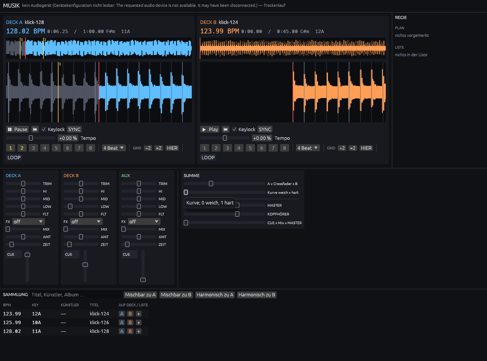
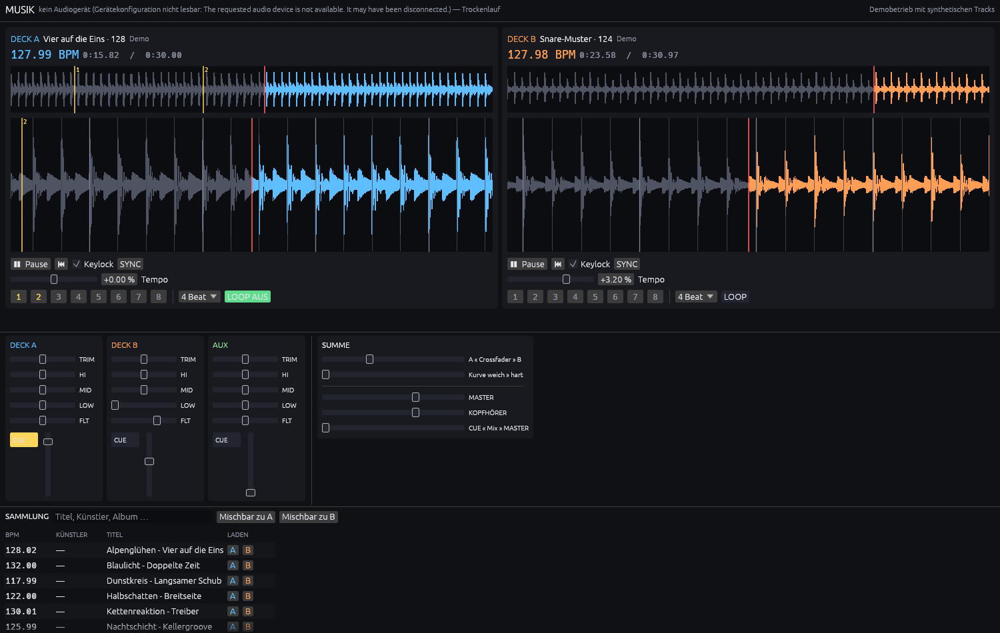

# Musik

Traktor-artiges DJ-/Musik-Tool, das generative Musik als gleichberechtigte
Quelle behandelt — mit dem Fernziel eines Agenten-Teams, das Musik aus den
Reaktionen der Crowd formt.

Status: **acht von zehn Phasen gebaut.** Decks mit Keylock, Hot Cues und
Loops; Mixer mit EQ, Filter, Crossfader, Cue-Bus und AUX; Analyse für Tempo,
Beatgrid und Wellenform; Sync über Tempo *und* Phase; Sammlung mit
Traktor-Import; Oberfläche mit zwei Decks, Wellenform, Beatgrid und
Plattenkiste; vier Effekte hinter dem Fader; **Fernsteuerung über einen
selbstbeschreibenden Steuerraum**. Nativ in Rust. Was fehlt, sind Stems,
Mitschnitt und MIDI.



## Zielbild

Drei Ebenen, aufeinander aufbauend:

1. **Ein DJ-Werkzeug**, das sich wie Traktor bedienen lässt — Decks, Mixer,
   Beatgrid, Library.
2. **Generierte Tracks als normale Quelle.** Ein Deck unterscheidet nicht
   zwischen einer Datei von der Platte und einem Track, der gerade per Prompt
   entstanden ist.
3. **Ein Agenten-Team, das die Crowd liest.** Die Menge schreibt keine Noten,
   aber ihre Reaktion wird Eingabe in Auswahl, Übergang und Komposition.

Ebene 1 ist die Voraussetzung für alles andere. Ohne ein Tool, das mixt, gibt
es nichts, was Agenten steuern könnten.

## Dokumentation

| Dokument | Inhalt |
| --- | --- |
| **[docs/PLAN.md](docs/PLAN.md)** | **Vollständiger Bauplan der DJ-Software — Architektur, Phasen, Risiken** |
| [docs/TRAKTOR-REFERENZ.md](docs/TRAKTOR-REFERENZ.md) | Was Traktor Pro 4 kann, was wir davon übernehmen |
| [docs/MIXXX.md](docs/MIXXX.md) | Mixxx als Referenz — was übernehmbar ist, warum es nicht eingebettet werden kann |
| **[docs/STEUERUNG.md](docs/STEUERUNG.md)** | **Fernsteuerung: Socket, Protokoll, selbstbeschreibender Steuerraum** |
| [docs/BAUSTEINE.md](docs/BAUSTEINE.md) | Fertige Bibliotheken für Audio, Analyse, Stems — inkl. Lizenzfallen |
| [docs/APIS.md](docs/APIS.md) | Generierungs-APIs und Sample-Quellen, Zugangsstatus |
| [docs/AGENTEN.md](docs/AGENTEN.md) | Multi-Agenten-Team und Crowd-Feedback-Schleife |
| [docs/VIBEMIND.md](docs/VIBEMIND.md) | Anschluss an VibeMind — MCP, Arbeitsteilung, Lizenzfolgen |
| [docs/ARCHITEKTUR.md](docs/ARCHITEKTUR.md) | Bausteine und Schnittstellen |

## Aktuelle Blocker

**Suno hat keine öffentliche Entwickler-API.** Stand August 2026 gibt es nur ein
kuratiertes Partner-Programm mit Bewerbungsformular (seit Juli 2026) — keine
Endpunkte, keine Doku, kein Termin. Generierung ist damit vorerst nicht über
Suno machbar.

Konsequenz: Der Generierungs-Teil wird **hinter einer Adapter-Schnittstelle**
gebaut und startet mit einem erreichbaren Anbieter (Vorschlag: ElevenLabs
Music). Suno wird später ein weiterer Adapter, kein Umbau. Details und
Alternativenvergleich in [docs/APIS.md](docs/APIS.md).

## Roadmap

**Acht von zehn Phasen sind gebaut.** Die Software lässt sich bedienen:
Tracks aus der Sammlung auf die Decks legen, Wellenform und Beatgrid sehen,
mischen, mit Effekten. Was fehlt, sind Stems, Mitschnitt und MIDI.

Der ausführliche Bauplan der DJ-Software mit Architektur, Abnahmekriterien und
Risiken liegt in **[docs/PLAN.md](docs/PLAN.md)**. Grobe Reihenfolge:

| Phase | Inhalt |
| --- | --- |
| 1 ⚙️ | Mehrdeck-Engine mit Mixer, Cue-Bus und AUX — Code steht, Abnahme braucht Hardware |
| ~~2~~ ✅ | ~~Analyse-Pipeline (BPM, Grid, Peaks)~~ |
| ~~3~~ ✅ | ~~UI mit Wellenformen, Beatgrid und Plattenkiste~~ |
| ~~4~~ ✅ | ~~Sync und Beatmatching über Tempo und Phase~~ |
| ~~5~~ ✅ | ~~Hot Cues und Loops~~ |
| ~~6~~ ✅ | ~~Library inkl. Traktor-Import~~ |
| ~~S~~ ✅ | ~~Steuerraum und Fernsteuerung~~ — [docs/STEUERUNG.md](docs/STEUERUNG.md) |
| ~~7~~ ✅ | ~~Effekte: Delay, Gater, Flanger, Crusher — post-fader, tempo-synchron~~ |
| **8–10** | **Stems · Mitschnitt · MIDI-Controller** |

Zum Auflegen fehlt jetzt nur noch Hardware: Phase 1 ist abgenommen, sobald der
Cue-Bus hörbar getrennt auf den Ausgängen 3/4 liegt, und das braucht ein
Interface mit vier Ausgängen.

Darauf setzen die beiden Schichten aus dem Zielbild auf:

| Phase | Inhalt | Abhängig von |
| --- | --- | --- |
| G1 | Generierungs-Adapter: Prompt → Track → Deck, asynchron mit Queue | 6, API-Zugang |
| A1 | Crowd-Signale einsammeln und visualisieren — noch ohne Steuerung | 6 |
| A2 | Agenten-Team: Energie-Analyse, Set-Planung, Übergangssteuerung | G1, A1 |

G1 hängt am API-Zugang, A1 nicht — Crowd-Signale lassen sich auch gegen eine
reine Datei-Library testen.

## Tech-Stack

**Nativ, in Rust.** Ausschlaggebend war der getrennte Kopfhörer-Cue-Ausgang,
nicht die Latenz — ohne Vorhören ist ernsthaftes DJing nicht möglich, und im
Browser gibt es das nicht sauber. Rust statt C++, weil der Stack damit klein und
permissiv bleibt — zum Entscheidungszeitpunkt war die Lizenzfrage noch offen,
und der Werkzeugkasten sollte sie nicht vorwegnehmen.

| Crate | Lizenz | Wofür |
| --- | --- | --- |
| `cpal` | Apache-2.0 | Audioausgabe |
| `rusqlite` | MIT | Sammlung als SQLite-Datei |
| `quick-xml` | MIT | Traktor-`collection.nml` lesen |
| `symphonia` | MPL-2.0 | MP3, FLAC, WAV, AAC/M4A, OGG |
| `rustfft` | MIT/Apache-2.0 | STFT für die Onset-Erkennung |
| `rtrb` | MIT/Apache-2.0 | Lock-freier Ringpuffer für AUX |
| `blake3`, `serde`, `base64` | permissiv | Fingerabdruck und Sidecar |
| `eframe`, `egui` | MIT/Apache-2.0 | Oberfläche |
| `image` | MIT/Apache-2.0 | Screenshots schreiben |

Zeitstreckung (WSOLA) und Tempoerkennung sind selbst implementiert — damit ist
der gesamte Stack MIT-verträglich. Rubber Band wäre beim Stretching besser, ist
aber GPL und würde einen späteren Anschluss an VibeMind verbauen (siehe unten).
Reicht die eigene Variante hörbar nicht, ist `signalsmith-stretch` (MIT) der
Weg, der beide Optionen offenlässt. Details in
[docs/BAUSTEINE.md](docs/BAUSTEINE.md#phase-0-was-gebaut-ist).

**UI: egui/eframe**, entschieden. Begründung und die verworfenen Alternativen
(Tauri, Electron) in [docs/PLAN.md](docs/PLAN.md#entschiedene-punkte).

## Nicht-Ziele (vorerst)

- Kein DVS/Timecode-Vinyl
- Keine Controller-/MIDI-Anbindung in den ersten Phasen
- Kein Streaming-Dienst-Import (Spotify, Beatport)
- Keine Echtzeit-Stem-Separation — beim Import vorberechnen (siehe
  [docs/BAUSTEINE.md](docs/BAUSTEINE.md#stem-separation))

## Entschieden

**Nativ in Rust** (Phase 0) und **nicht kommerziell.**

Die zweite Entscheidung entspannt die Lizenzlage: Copyleft greift bei
*Weitergabe*, nicht bei Nutzung. Solange das Tool auf dem eigenen Rechner bleibt
und nicht verteilt wird, entstehen aus GPL-Abhängigkeiten überhaupt keine
Pflichten — deshalb liegt auch bewusst keine `LICENSE`-Datei im Repo.

⚠️ **Trotzdem bleibt der Stack permissiv.** Ein späterer Anschluss an
[VibeMind](https://github.com/Flissel/Vibemind_V1) steht im Raum, und das ist
MIT und zur Veröffentlichung vorgesehen — also Weitergabe. Damit fielen
Rubber Band, aubio und Essentia wieder aus, und CC-BY-NC-Samples dürften nicht
mitgeliefert werden. Solange die Frage offen ist, ist jede GPL-Abhängigkeit eine
Tür, die hinter einem zufällt. Details in
[docs/VIBEMIND.md](docs/VIBEMIND.md#1-die-lizenzlage-kippt-zurück).

Der aktuelle Stand ist sauber: alles im Repo ist MIT-verträglich.

## Offene Entscheidungen

1. **Wieviel Kontrolle behält der Mensch am Pult?** Vollautomat oder Assistent —
   prägt das Agenten-Design.
2. **Audio-Interface mit vier Ausgängen.** Ohne getrennten Cue-Ausgang lässt
   sich Phase 1 nicht abnehmen — eine Hardware-, keine Softwarefrage. Warum
   zwei Geräte nicht gehen, steht in
   [docs/PLAN.md](docs/PLAN.md#1-der-cue-ausgang-zwingt-zu-einem-gerät-mit-vier-ausgängen).

## Setup

Voraussetzung: Rust (aktuelles Stable). Unter Linux zusätzlich die
ALSA-Header — `sudo apt install libasound2-dev`.

```sh
cargo build
cargo test
```

Ein Deck fahren:

```sh
cargo run -p musik-cli -- /pfad/zum/track.mp3
```

Danach im Prompt:

| Befehl | Wirkung |
| --- | --- |
| `p` | Play/Pause |
| `t +6` | Tempo +6 % (oder `t 1.06` als Verhältnis) |
| `k` | Keylock an/aus — Tonhöhe beim Tempowechsel halten |
| `s 30` | Auf Sekunde 30 springen |
| `i` | Status |
| `q` | Beenden |

Der Vergleich, um den es geht: `t +6` einmal mit und einmal ohne `k`. Mit
Keylock bleibt die Tonhöhe stehen, ohne wandert sie hoch wie beim
Plattenspieler.

Tracks analysieren — braucht **kein** Audiogerät:

```sh
cargo run -p musik-cli --bin musik-analyze -- ~/Musik/*.mp3
```

Liefert BPM, Beatgrid-Anker und Wellenform-Spitzen und legt sie als Sidecar
unter `.musik-analyse/` ab, adressiert über einen Hash des Audioinhalts. Ein
zweiter Lauf über dieselbe Datei liest aus dem Cache; ein umbenannter Ordner
entwertet die Analyse nicht.

Einen Übergang rendern — ebenfalls **ohne** Audiogerät:

```sh
cargo run -p musik-cli --bin musik-mix -- --a a.mp3 --b b.mp3 --out mix.wav
```

Zieht Deck B per Keylock auf das Tempo von A, fährt einen Crossfade mit
Bass-Swap und schreibt das Ergebnis als WAV. Ohne `--a`/`--b` nimmt es
synthetische Loops — praktisch, um die Engine zu hören, wenn gerade keine
Musik zur Hand ist. `--aux <datei>` legt einen dritten Kanal auf Thru dazu,
der den Crossfader unbeschadet übersteht.

Sammlung aufbauen — ebenfalls **ohne** Audiogerät:

```sh
cargo run -p musik-cli --bin musik-lib -- scan ~/Musik
cargo run -p musik-cli --bin musik-lib -- import-traktor ~/Documents/Native\ Instruments/Traktor/collection.nml
cargo run -p musik-cli --bin musik-lib -- mixable 128
```

`scan` dekodiert, analysiert und legt Tempo, Beatgrid und Inhalts-Hash in einer
SQLite-Datei ab. `import-traktor` übernimmt Tempo, Beatgrid und Hot Cues aus
einer bestehenden Traktor-Sammlung — ⚠️ gegen eine *echte* `collection.nml` ist
das noch nicht geprüft, nur gegen selbst geschriebene Beispiele. Der erste Lauf
gehört stichprobenartig nachgesehen.

Auflegen — **hier** braucht es ein Audiogerät:

```sh
cargo run --release -p musik-app -- --db musik.db
```

| Aufruf | Wirkung |
| --- | --- |
| *(ohne Argumente)* | synthetische Demo-Tracks auf beiden Decks |
| `--db musik.db` | die eigene Sammlung in der Plattenkiste |
| `--a a.mp3 --b b.mp3` | zwei Dateien direkt auf die Decks |
| `--screenshot bild.png` | ein Bild aufnehmen und beenden |

Ohne Audiogerät startet die Oberfläche trotzdem: der Mixer läuft dann von einem
Taktgeber im Leerlauf, die Decks bewegen sich, die Bedienung lässt sich
beurteilen — nur hören kann man nichts. Findet die Soundkarte weniger als vier
Ausgänge, sagt die Kopfzeile das und das Vorhören entfällt.

`--release` ist keine Zierde: die Analyse eines frisch geladenen Tracks dauert
im Debug-Build spürbar länger.

Von außen steuern, während sie läuft:

```sh
$ nc -U "$XDG_RUNTIME_DIR/musik.sock"
list deck1.
set deck1.play 1
set channel1.fader 0.8
setn channel2.eq_low 0        # normiert, für MIDI
```

`list` liefert zu jedem Control Typ, Bereich, Einheit, Schreibbarkeit und
Bedeutung — der Steuerraum beschreibt sich selbst, ein Handbuch ist dafür nicht
nötig. Das ist die Grundlage für die Agenten-Schicht und für den Anschluss an
VibeMind. Details in [docs/STEUERUNG.md](docs/STEUERUNG.md).



Für API-Keys siehe [`.env.example`](.env.example).
