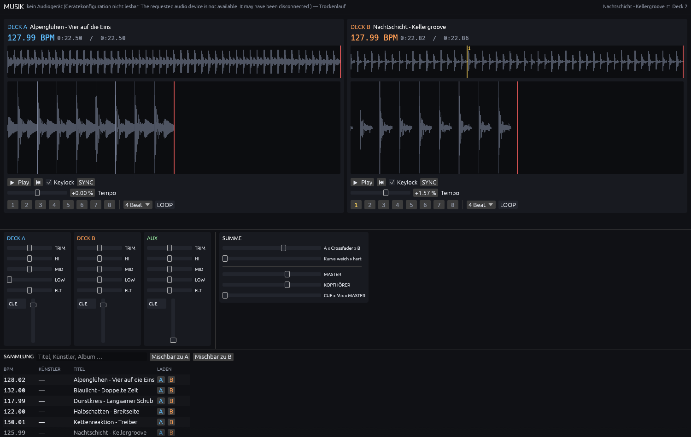
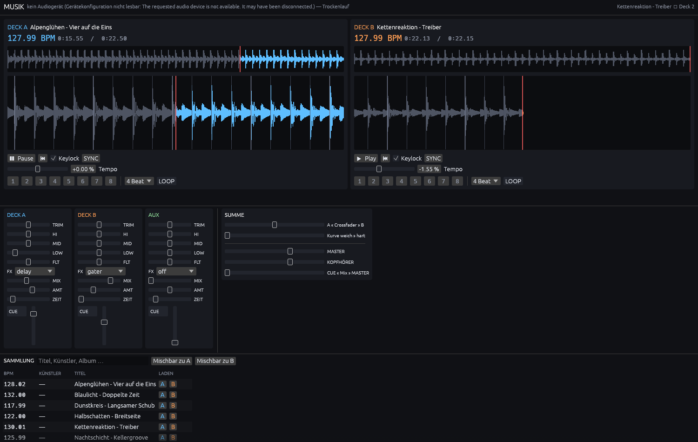
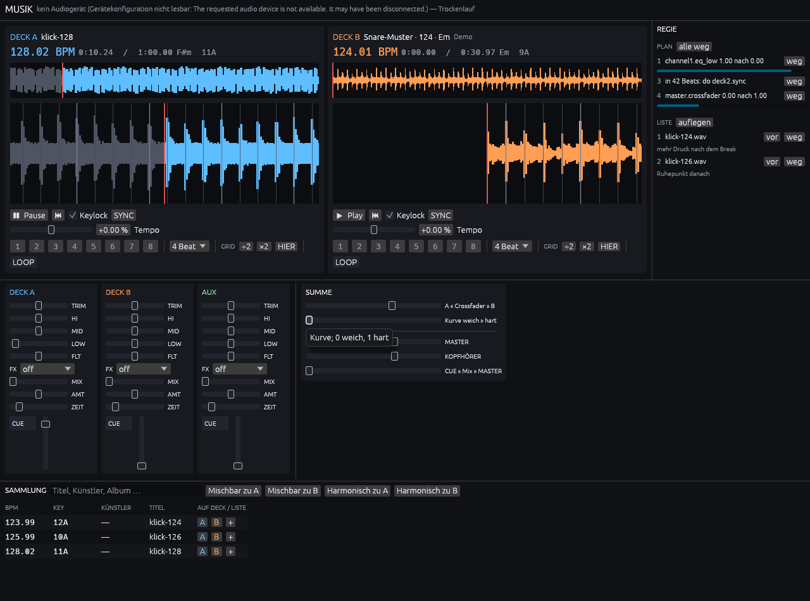

# Steuerung von außen

Die Anlage lässt sich fernsteuern, während sie läuft. Ein Socket, ein
Zeilenprotokoll, keine Bibliothek nötig:

```sh
$ nc -U "$XDG_RUNTIME_DIR/musik.sock"
set deck1.play 1
ok deck1.play 1
```

Das ist der Punkt, an dem sich dieses Projekt von den fertigen Alternativen
unterscheidet. Mixxx hat ein sehr ähnliches Control-System im Inneren — dort
laufen Tastatur, MIDI, HID und Oberfläche über dieselben benannten Werte —
aber es ist prozessintern. Nach außen spricht Mixxx OSC nur *ausgehend*:
Es sendet Zustand, es nimmt keine Befehle entgegen. Siehe
[MIXXX.md](MIXXX.md#was-mixxx-nicht-löst).

Ohne diese Schnittstelle gäbe es die Agenten-Schicht aus
[AGENTEN.md](AGENTEN.md) nicht, und der Anschluss an
[VibeMind](VIBEMIND.md) hätte nichts, woran er andocken könnte.

## Der Steuerraum

Jedes Control heißt `gruppe.element`:

| Gruppe | Was |
| --- | --- |
| `deck1`, `deck2`, … | Abspieler: Transport, Tempo, Hot Cues, Schleifen |
| `channel1`, `channel2`, … | Züge am Mischpult: Trim, EQ, Filter, Fader, Cue |
| `master` | Crossfader, Summe, Kopfhörer |

Deck und Kanal sind absichtlich getrennt. Bei Mixxx fallen sie in `[Channel1]`
zusammen, was so lange gutgeht, bis ein Kanal etwas führt, das kein Deck ist —
bei uns der AUX-Eingang, der einen Zug hat und kein Deck.

## Befehle

| Befehl | Wirkung |
| --- | --- |
| `list [praefix]` | Controls aufzählen, gefiltert nach Namensanfang |
| `get <control>` | Wert lesen |
| `set <control> <wert>` | Wert setzen; `-` leert (Hot Cues) |
| `setn <control> <0..1>` | normiert setzen — für MIDI |
| `do <control> [arg]` | Aktion auslösen |
| `sub <control>…` | Änderungen melden lassen, statt zu fragen |
| `unsub [control]…` | abbestellen; ohne Argument alles |
| `help` | Übersicht |

Antworten beginnen mit `control`, `value`, `ok` oder `err`. Ein `err` ist immer
als solches erkennbar; nichts scheitert stumm.

## Aktionen sind keine Werte

`sync`, `load`, einen Hot Cue anspringen — das sind Auslöser, keine
Reglerstellungen. Mixxx modelliert so etwas als Control, in das man 1.0
schreibt (`[Channel1],cue_gotoandplay`). Das funktioniert, ist aber dieselbe
Schwäche wie beim `double`: Ein Auslöser hat keinen Zustand, den man lesen
könnte, und `get` darauf müsste etwas erfinden.

Hier haben sie ein eigenes Verb:

```text
do deck2.sync                → sync deck2 auf deck1 tempo 1.01570 phase -0.1178
do deck1.load /musik/a.wav   → load deck1 angenommen
do deck2.jump_cue 1
do deck1.beatjump -4
do master.search techno
do master.search_mixable 128
do master.search_harmonic 8A
get deck1.sync               → err deck1.sync ist eine Aktion — mit 'do' auslösen
set deck1.sync 1             → err deck1.sync ist eine Aktion — mit 'do' auslösen
do deck1.play                → err deck1.play ist keine Aktion — mit 'set' setzen
```

**`sync` ist Tempo *und* Phase**, in einem Befehl. Ohne das müsste ein Agent
beide BPM lesen, den Quotienten bilden, das Tempo setzen und die Phase selbst
ausrechnen — und die Phase vergisst man dabei, weil das Ergebnis auch ohne sie
plausibel aussieht.

**`load` arbeitet im Hintergrund.** Dekodieren und Analysieren dauern Sekunden,
und das Pult liegt währenddessen unter einem Mutex, an dem die Oberfläche
hängt. Der Befehl meldet deshalb *Annahme*, nicht Erledigung; der Fortschritt
steht in `deckN.load_status`. Ein Auftrag, der abgelehnt wird — falscher Pfad
etwa — lässt den Status unberührt, statt ein Laden vorzutäuschen, das nie
begonnen hat.

## Zuhören statt fragen

```text
sub deck1.finished deck1.position
ok sub 2 neu, 2 gesamt
value deck1.finished 0
value deck1.position 12.354000
value deck1.position 12.404000
…
value deck1.finished 1
```

Das erste, was ein Abo meldet, ist der Ist-Zustand — sonst müsste man nach dem
Abonnieren noch einmal `get` sagen. Danach kommt nur, was sich geändert hat.

Ehrlich gesagt: Das Pult meldet nichts von sich aus, der Server vergleicht alle
50 ms. Für Werte, die im Audio-Thread laufen, wäre eine echte Benachrichtigung
auch sinnlos — die Position ändert sich mit jedem Sample, die will niemand
vollständig. Der Gewinn liegt darin, dass der Bediener das nicht selbst bauen
muss, und dass `deckN.finished` ohne Dauerabfrage ankommt.

## Der Steuerraum beschreibt sich selbst

Das ist der zweite Unterschied. `list` liefert nicht bloß Namen, sondern
Typ, Bereich, Einheit, Schreibbarkeit und eine Bedeutung:

```text
$ echo 'list deck1.tempo' | nc -U -q1 "$XDG_RUNTIME_DIR/musik.sock"
control deck1.tempo zahl 0.92..1.08 faktor rw Tempo-Regler; 1.0 ist die Originalgeschwindigkeit
ok 1 Controls
```

Wer das gelesen hat, braucht kein Handbuch: Er weiß, dass es eine Zahl ist,
zwischen 0,92 und 1,08 liegt, ein Faktor ist, sich schreiben lässt und was sie
bedeutet. Bei Mixxx steht all das in der Dokumentation, und ein laufendes
Programm lässt sich nicht fragen.

Der praktische Gewinn ist doppelt:

- **Für Agenten.** Die MCP-Werkzeugbeschreibungen lassen sich aus dem Katalog
  erzeugen, statt sie von Hand doppelt zu pflegen — zwei Beschreibungen, die
  auseinanderlaufen, gibt es dann nicht.
- **Für die eigene Oberfläche.** Die Schieberegler im Mixer holen sich Bereich
  und Tooltip aus demselben Katalog. Ein neues Control ist ohne eine Zeile in
  der Oberfläche bedienbar, und der Hilfetext, den ein Agent sieht, ist
  derselbe, der unter der Maus erscheint.

## Werte sind typisiert

Bei Mixxx ist jedes Control ein `double`; `play` ist 0.0 oder 1.0, eine
Zuweisung eine durchnummerierte Zahl. Das ist einfach zu bauen und schwer zu
benutzen — ein Tippfehler wird zu einem gültigen Wert statt zu einem Fehler.

Hier gibt es Schalter, Zahlen mit Bereich, Auswahlen mit Namen und Text:

```text
set channel1.assign thru      → ok channel1.assign thru
set channel1.assign mitte     → err channel1.assign kennt nur: a, b, thru
set deck1.duration 5          → err deck1.duration lässt sich nur lesen
```

Zwei bewusste Ausnahmen von der Strenge:

- **Werte außerhalb des Bereichs werden begrenzt, nicht abgelehnt.** Ein
  MIDI-Regler auf Anschlag meint das Maximum, keinen Fehler.
- **Die Bestätigung nennt den Wert, der wirklich angekommen ist** — nicht den
  gesendeten. `set channel1.fader 9` antwortet `ok channel1.fader 1`.

## Ein vollständiger Übergang, der wirklich lief

Kein Mausklick, keine Kenntnis der Oberfläche — nur Control-Namen:

```sh
do master.search Alpen                  # was gibt es?
do deck1.load "…/Alpenglühen.wav"       # auflegen
do master.search_mixable 128            # was passt vom Tempo?
get deck1.key_camelot                   # → 8A
do master.search_harmonic 8A            # was passt von der Tonart?
do deck2.load "…/Nachtschicht.wav"
set deck1.play 1
set channel1.fader 0.9
do deck2.sync                           # Tempo UND Phase, in einem Befehl
set deck2.cue1 8.0
do deck2.jump_cue 1
set deck2.play 1
setn channel2.eq_low 0                  # Bass raus …
set channel2.fader 0.9
set master.crossfader 0.25
setn channel1.eq_low 0                  # … und drüben rein: Bass-Swap
setn channel2.eq_low 0.5
do deck1.beatjump -4
sub deck1.finished deck1.position       # aufs Ende horchen
```

Die Antwort auf `do deck2.sync` war

```text
sync deck2 auf deck1 tempo 1.01570 phase -0.1178
```

und danach standen beide Decks auf **127,986 BPM** — 126,008 × 1,0157. Die
Oberfläche zeigte das Ergebnis unmittelbar: geladene Titel, Tempo +1,57 %,
die Hot-Cue-Marke in der Wellenform, gekillten Bass, Crossfader auf +0,25.



Für eine ältere, einfachere Aufnahme ohne Laden und Sync siehe
[`bilder/fernsteuerung.png`](bilder/fernsteuerung.png).

## Warum ein Unix-Socket und kein TCP-Port

Eine Sicherheitsentscheidung, keine Bequemlichkeit. Wer hier hineinschreibt,
steuert die Anlage. Ein offener TCP-Port täte das für jeden im selben Netz —
auf einer Bühne mit fremdem WLAN ist das keine theoretische Sorge. Ein
Unix-Socket erbt die Rechte des Dateisystems: Wer die Datei nicht öffnen darf,
kommt nicht hinein.

Der Standardpfad liegt aus demselben Grund in `$XDG_RUNTIME_DIR` und nicht in
`/tmp` — dort könnte jeder andere Benutzer des Rechners mitsteuern. Mit
`--socket <pfad>` lässt er sich verlegen.

Es gibt **keine Authentifizierung**. Sie wäre bei Dateisystemrechten
verdoppelt. Sollte die Steuerung je über das Netz gehen, ist das die Stelle, an
der sie nachzurüsten ist — vorher nicht.

## Echtzeit bleibt unangetastet

Das Pult schreibt nie in den Audio-Callback. Es schickt Kommandos in dieselbe
lock-freie Schlange, die auch die Oberfläche benutzt, und liest aus Atomics
und aus dem eigenen Spiegel. Der Mutex um das Pult wird nur von Bedienern
genommen — Oberfläche, Socket, später MIDI. Der Audio-Thread sieht ihn nie.

## Die Probe aufs Exempel: die Effekte

Als die Effekte dazukamen, bekam die Oberfläche **keine einzige Zeile** für
sie. Der Kanalzug holt sich seine Regler aus dem Katalog — Reihenfolge,
Bereich, Beschriftung, Hilfetext. Vier neue Einträge im Katalog, und das
FX-Feld stand da, samt Auswahlfeld mit den richtigen Namen:

```text
$ echo 'list channel1.fx' | nc -U -q1 "$XDG_RUNTIME_DIR/musik.sock"
control channel1.fx auswahl off|delay|gater|flanger|crush - rw Effekt hinter dem Fader; …
```

Ein Nebeneffekt davon ist, dass die Katalogreihenfolge jetzt die Anordnung am
Gerät ist: Höhen oben, Bässe unten. Beim ersten Versuch stand der EQ
verkehrtherum, weil im Katalog `eq_low` vor `eq_high` stand — im Zweifel greift
man beim Auflegen daneben, und deshalb ist die Reihenfolge dort jetzt
festgehalten und begründet.



## Mitschnitt

```text
do master.record ~/sets/2026-08-13.wav
record läuft nach ~/sets/2026-08-13.wav
get master.record_seconds     → value master.record_seconds 6.784000
get master.record_dropped     → value master.record_dropped 0
do master.record_stop         → record ~/sets/2026-08-13.wav · 6.8 s
```

Aufgenommen wird die Summe **hinter dem Begrenzer** — also das, was auf die
Anlage geht, und nicht das, was vorher da war.

`record_dropped` ist kein Beiwerk. Der Audio-Thread darf nicht auf die Platte
schreiben; er legt in einen Ringpuffer, ein eigener Thread leert ihn. Kommt der
nicht hinterher, gehen Frames verloren — blockieren wäre schlimmer. Verloren
heißt hier aber nicht verschwiegen: Der Zähler ist abfragbar, und `record_stop`
sagt es von sich aus dazu. Ein Mitschnitt mit Lücken, der aussieht wie einer
ohne, wäre das schlechteste Ergebnis von allen.

## Antworten lesen

Wer einen eigenen Bediener schreibt, braucht eine Abbruchregel. Eine Antwort
endet mit einer Zeile, die mit `ok`, `err` oder `value` beginnt:

| Befehl | Antwort |
| --- | --- |
| `get` | genau eine `value`-Zeile |
| `list` | eine `control`-Zeile je Treffer, dann `ok N Controls` |
| `set`, `setn` | eine `ok`- oder `err`-Zeile |
| `do` | keine bis mehrere Infozeilen, dann `ok` oder `err` |
| `sub` | `ok`, danach `value`-Zeilen, wann immer sich etwas ändert |

Ein Abo ist der einzige Fall, in dem ungefragt etwas hereinkommt. Wer
abonniert, sollte deshalb getrennt lesen und schreiben.

## Anschluss für Agenten: MCP

Für Agenten liegt eine Brücke bei — [`mcp/`](../mcp/README.md), ein
MCP-Server, der dieses Protokoll in Werkzeuge übersetzt. Zwölf Werkzeuge statt
zweihundert: `musik_set` und `musik_do` erreichen alles, `musik_status` und
`musik_search` sparen die häufigsten Wege, `musik_ramp`, `musik_schedule` und
`musik_cancel` reichen den Zeitplan durch, `musik_queue`, `musik_queue_add` und
`musik_queue_next` die Liste.

Der Gewinn aus dem selbstbeschreibenden Katalog wird dort eingelöst: Die
Beschreibungen von `musik_set` und `musik_do` **erzeugt der Server beim Start
aus dem laufenden Programm**. Was ein Agent liest, ist dasselbe, was im Katalog
steht und in der Oberfläche als Tooltip erscheint.

Beim Bauen fiel dabei auf, dass `list` das Argument einer Aktion nicht
mitgab — es stand im Katalog, verließ aber den Prozess nie. Jetzt steht es in
der Bereichsspalte, und `deck1.load` sagt von sich aus, dass es einen Pfad
will.

## Zeit: Übergänge statt Reglerstellungen

Der Teil, der aus dem Steuerraum ein Werkzeug für ein **Team von Agenten**
macht. Ein Übergang ist keine Folge von Reglerstellungen, sondern eine Bewegung
über Takte. Wer das von außen nachbaut, müsste in einer engen Schleife
`beat_phase` pollen und dazwischen schlafen — über eine Leitung, deren Timing
dem Scheduler des Betriebssystems ausgeliefert ist. Das eiert hörbar, und der
Agent ist die ganze Zeit blockiert.

```text
set channel2.fader 0.0
ramp channel1.eq_low 0.0 8            # Bass raus über 8 Beats
in 8 ramp channel2.fader 0.9 16       # danach Deck B rein über 16
in 8 ramp master.crossfader 1.0 16
plan                                  # was vorgemerkt ist
cancel 2                              # einen Auftrag zurücknehmen
```

Drei Zeilen, dann kann der Agent auflegen. Gelaufen ist es so:

| nach | `channel1.eq_low` | `channel2.fader` | `master.crossfader` |
| --- | --- | --- | --- |
| 2 s | 0,47 | 0 | 0 |
| 5 s | 0 | 0,13 | 0,15 |
| 9 s | 0 | 0,90 | 1,00 |

**Gerechnet wird in Beats, nicht in Sekunden.** Ein Plan in Sekunden geht
schief, sobald jemand am Tempo dreht; einer in Beats bleibt musikalisch
richtig. Steht das Deck, steht auch der Plan — was gestoppt ist, hat keine
Takte. Welches Deck den Takt vorgibt, ergibt sich von selbst: Ein Kanalzug erbt
ihn von dem Deck, das auf ihm liegt, ein Deck ist sein eigener Taktgeber, und
die Summe nimmt das erste Deck mit Grid. Mit einem vierten Wort lässt sich das
überschreiben (`ramp master.crossfader 1.0 16 deck2`).

### Der Mensch gewinnt

**Eine Rampe gibt auf, sobald jemand anders denselben Regler anfasst.**

```text
> ramp channel1.fader 0.0 64
< ok plan 5 ramp channel1.fader nach 0 über 64 Beats
  … nach 3 s steht der Fader bei 0.909699 und wandert
> set channel1.fader 0.75
  … nach 3 s steht er immer noch bei 0.75, und der Plan ist leer
```

Ohne das wäre die Automatik stärker als der Griff daneben: Man zieht den Fader
zu, und einen Wimpernschlag später steht er wieder offen. Geprüft wird nicht
über eine Kennung, sondern über den Wert selbst — steht dort etwas anderes, als
die Rampe zuletzt geschrieben hat, war jemand anders am Werk. Das gilt für
einen Menschen an der Oberfläche genauso wie für einen zweiten Agenten.

Damit ist `plan` zugleich das **gemeinsame Blatt**: Wer mitliest, sieht, was die
anderen vorhaben, statt es aus Reglerbewegungen zu erraten. Und weil der Mensch
an der Oberfläche derselbe Mitbediener ist, steht es dort auch — in der
Regie-Spalte rechts, mit Fortschrittsbalken je Rampe. Ohne sie gewönne er jeden
Griff blind: Er sähe einen Fader wandern und wüsste nicht, ob ihn jemand zieht
oder ob er selbst hängengeblieben ist.



Der Takt liegt bei 5 ms — bei 128 BPM etwa ein Prozent eines Beats. Für eine
Blende unhörbar, für einen harten Schnitt auf die Eins gerade noch vertretbar.
**Sample-genau ist das ausdrücklich nicht**; dafür müssten die Befehle im
Audio-Callback liegen, und dorthin gehört keine Reglerlogik.

### Über MCP

Dieselben vier Verben, für einen Agenten, der kein Zeilenprotokoll spricht:

| Protokoll | MCP |
| --- | --- |
| `ramp <control> <ziel> <beats> [deck]` | `musik_ramp` |
| `in <beats> ramp …` | `musik_ramp` mit `in_beats` |
| `in <beats> <befehl>` | `musik_schedule` |
| `plan` | Feld `plan` in `musik_status` |
| `cancel [id]` | `musik_cancel` |

Der Plan hängt bewusst an `musik_status` statt an einem eigenen Werkzeug: Wer
eine Momentaufnahme nimmt, bevor er zugreift, soll die Absichten der anderen
sehen, ohne sie extra abfragen zu müssen. Und `musik_cancel` verlangt für
„alles" einen eigenen Schalter — eine vergessene Nummer soll nicht die Arbeit
der anderen leeren.

## Was als Nächstes kommt

Der Zeitplan sagt, **wann** etwas geschieht. Die Liste sagt, **was** als
Nächstes kommt — die zweite Hälfte der Koordination, sobald mehr als einer
auswählt.

```text
do master.queue_add /musik/track.mp3   → queue 1 angehaengt /musik/track.mp3
do master.queue_note 1 mehr Druck nach dem Break
do master.queue                        → queue 1 /musik/track.mp3 mehr Druck nach dem Break
do master.queue_bump 1                 → der als Nächstes
do master.queue_next                   → load deck2 angenommen
                                         queue 1 abgenommen /musik/track.mp3
                                         notiz mehr Druck nach dem Break
```

Sie liegt im Pult, hinter demselben Mutex wie alles andere. Wer abnimmt, nimmt
den Eintrag heraus — ein zweiter, der im selben Moment abnimmt, bekommt den
nächsten und nicht denselben. Zwei Agenten, die ihre Liste je für sich halten,
legen irgendwann beide auf dasselbe Deck.

**Jeder Eintrag trägt eine Notiz**, und das ist der Unterschied zu einer
Playlist. Wer vormerkt, weiß warum; ohne die Notiz muss der Nächste den Grund
aus BPM und Tonart erraten, und bei einem Team von Agenten heißt erraten:
erfinden.

Drei Entscheidungen, die aus dem Mehrbedienerfall kommen:

- **Derselbe Pfad wird nicht zweimal angenommen** — die Antwort nennt die
  Nummer, unter der er schon steht. Zwei, die unabhängig nach 128 BPM in 8A
  suchen, finden denselben Track.
- **Nummern bleiben stehen**, auch wenn davor etwas herausgenommen wird. Sonst
  spräche ein Agent, der sich Nummer 3 gemerkt hat, plötzlich über einen
  anderen Track.
- **`queue_next` legt ohne Deckangabe nur auf ein Deck, das nicht läuft.**
  Laufen alle, wird gefragt statt geraten; mit `queue_next deck1` geht es
  trotzdem, wenn es wirklich so gemeint ist. Und scheitert das Laden, kommt der
  Eintrag zurück nach vorn, statt still zu verschwinden.

Auch die Liste steht in der Regie-Spalte, mit `vor`, `weg` und `auflegen`; in
der Plattenkiste merkt ein `+` einen Track vor. Sonst wäre sie von der
Oberfläche aus nur lesbar und füllen könnte sie allein ein Agent.

## Was am Deck eingestellt wird, bleibt

Hot Cues liegen zur Laufzeit in den Atomics des Decks — dort sind sie richtig
aufgehoben, denn der Audio-Thread liest sie pro Block. Nur endete es dort auch:
Acht Cues gesetzt, Track neu geladen, weg. Und die Sammlung hatte die Tabelle
die ganze Zeit; der Traktor-Import füllte sie sogar, aber nichts las sie je.

```text
set deck1.cue1 4.5     → ok deck1.cue1 4.500000     (steht sofort in der Sammlung)
set deck1.cue1 -       → ok deck1.cue1 -            (Löschen wird genauso gespeichert)
```

**Sofort, nicht beim Beenden.** Ein Cue, der nur im Speicher steht, ist nach
einem Absturz weg, und abgestürzt wird beim Auflegen. Es sind acht Zeilen in
einer SQLite-Datei — das darf den Aufrufer kurz aufhalten, anders als das
Dekodieren beim Laden.

**Geschrieben werden nur die acht Tasten.** In derselben Tabelle liegen der
Grid-Anker aus dem Traktor-Import und Fade-Marker; ein Deck kennt die nicht und
darf sie deshalb nicht mit ersetzen (`Library::replace_hot_cues` statt
`replace_cues`).

### Das Beatgrid von Hand

Der Detektor liegt bei sperrigem Material daneben — bei einem Testtrack kam
180 BPM heraus, mit einer Konfidenz von 0,05. Ohne Korrektur wäre so ein Track
unbrauchbar:

```text
do deck1.grid_scale 0.5   → grid deck1 128.02 → 64.01 BPM
set deck1.position 2.5
do deck1.grid_here        → grid deck1 Anker auf 2.500 s
set deck1.bpm_grid 90     (geht auch direkt)
set deck1.grid_anchor 4.2
```

**`grid_scale` ist für den Oktavfehler da**, den mit Abstand häufigsten Fall;
der Anker bleibt dabei stehen, denn bei einer Halbierung lag jede zweite Eins
ohnehin richtig. **`grid_here` legt den Anker auf die Abspielposition** — der
klassische Handgriff, wenn man hört, wo die Eins liegt.

Genauer: auf die *Ziel*-Position. Ein `set position` setzt nur einen Wunsch,
den der Audio-Thread im nächsten Block ausführt; wer springt und sofort „hier"
sagt, meint die Stelle, auf die er gesprungen ist, nicht die, an der die
Anzeige noch steht.

Jede Korrektur landet sofort in der Sammlung, genau wie ein Cue. Ohne Grid
lässt sich kein Anker setzen und nichts skalieren — das wird gemeldet statt
geraten. Nur `bpm_grid` nimmt auch aus dem Nichts einen Wert an, sonst käme man
aus einem fehlenden Grid nie wieder heraus.

Beim Laden geht es rückwärts: Die gespeicherten Cues kommen aufs Deck, und ein
**Beatgrid aus der Sammlung schlägt die frische Analyse**. Was dort steht, kann
aus Traktor stammen oder von Hand korrigiert sein, und beides weiß mehr als ein
Detektor. Scheitert das Speichern — keine Sammlung geöffnet, Track nicht darin
—, steht der Cue trotzdem am Deck und der Grund in `deckN.load_status`.

## Harmonisch mischen

Tempo ist die halbe Trackauswahl. Zwei Stücke im gleichen Takt können trotzdem
gegeneinander klingen, wenn die Tonarten nicht zusammenpassen — deshalb gibt es
sie am Deck und in der Sammlung:

```text
get deck1.key            → value deck1.key Am
get deck1.key_camelot    → value deck1.key_camelot 8A
do master.search_harmonic 8A
                         → track 127.98 8A /musik/01.wav  Nachtschicht
                           track 125.99 8B /musik/02.wav  Alpenglühen
                           track 123.99 9A /musik/03.wav  Blaue Stunde
```

**Zwei Felder statt einem.** `key` ist die Schreibweise für Menschen (`Am`,
`F#`), `key_camelot` die zum Rechnen (`8A`, `2B`). Beides in eine Zeichenkette
zu packen hieße, dass jeder Leser sie wieder auseinandernehmen muss.
`search_harmonic` nimmt beide entgegen, und was keine Tonart ist, wird
**gemeldet** statt als leeres Ergebnis zurückzukommen — ein Tippfehler darf
nicht aussehen wie eine leere Sammlung.

Gesucht wird nach der Regel des Camelot-Rads: dieselbe Zahl (Paralleltonart),
eine weiter, eine zurück. Deshalb steht in jeder Trefferzeile jetzt eine
Camelot-Spalte hinter dem Tempo.

**Leer heißt unbekannt, nicht „passt zu allem".** Auf Bass und Drums allein
ermittelt die Analyse bewusst keine Tonart — warum, steht in
`crates/analysis/src/tonart.rs`. Diese Tracks tauchen in einer harmonischen
Suche nicht auf; das ist richtig so, denn ein geratener Wert würde beim Mischen
mehr kosten als ein fehlender.

## Auch die Oberfläche geht hier durch

Nicht nur die Regler: Suchen und Laden nehmen inzwischen denselben Weg. Ein
Klick auf „A" in der Plattenkiste löst `deck1.load` aus, das Suchfeld ruft
`master.search`, und „Harmonisch zu A" ruft `master.search_harmonic` mit der
Tonart von Deck 1. Auch die Cue-Knöpfe und die Grid-Korrektur gehen diesen Weg
— sie schrieben vorher direkt ins Deck, und genau dort wären sie an der
Sammlung vorbeigelaufen.

Das ist kein Selbstzweck. Vorher hatte die Oberfläche einen eigenen Ladepfad —
zwei Wege zum selben Ziel heißt zwei Stellen, an denen es schiefgehen kann, und
die seltener benutzte fällt seltener auf. Jetzt gilt: Was ein Agent kann, kann
die Oberfläche auch, und umgekehrt. Bricht der eine Weg, bricht der andere
sofort mit — und wird bemerkt.

## Was noch fehlt

- **Reverb.** Vier Effekte gibt es; ein guter Hall fehlt und ist ein eigenes
  Stück Arbeit.
- **Beatgrid korrigieren.** `set deck1.bpm_grid` ist nur lesbar; ein falsch
  erkanntes Grid lässt sich von außen nicht geraderücken.
- **Windows.** Unix-Sockets gibt es dort nicht; eine Named Pipe wäre die
  Entsprechung.
- **MIDI.** Der normierte Weg (`setn`) ist da, der Übersetzer von MIDI-CC auf
  Control-Namen noch nicht. Das ist Phase 10 — und mit dem Steuerraum im Rücken
  fast nur noch eine Tabelle.
- **MCP.** Die Werkzeugbeschreibungen lassen sich aus dem Katalog erzeugen; der
  Erzeuger fehlt noch.
